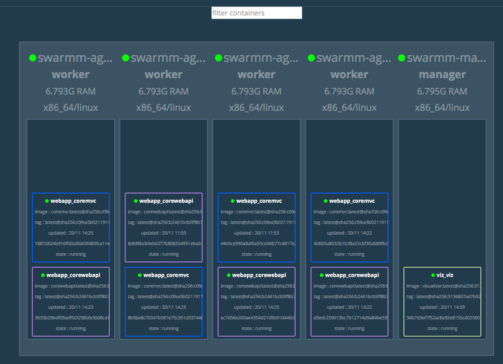
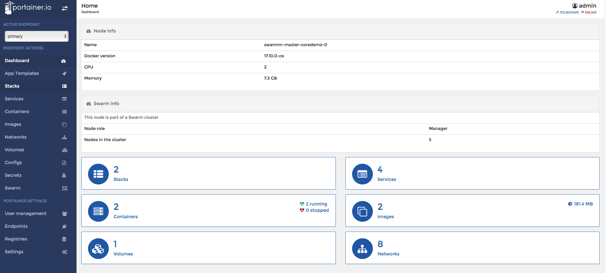
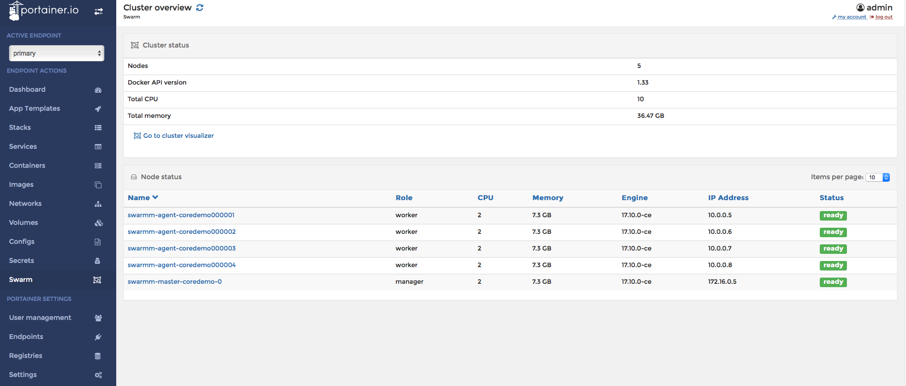
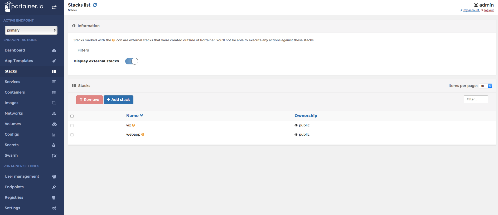
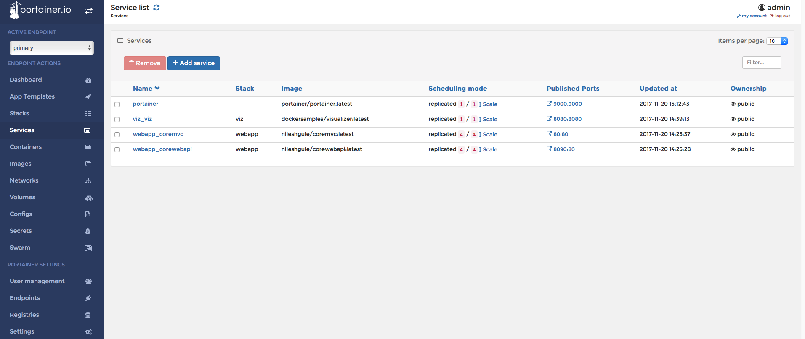

## Deploy Swarm using ACS
Use [ACS Engine swarm mode](https://azure.microsoft.com/en-us/resources/templates/101-acsengine-swarmmode/) as the default ACS uses standalone Swarm cluster which is quite old.

Deploy Azure Container Service in Docker Swarm mode with following options

## Azure container service setting
|Parameter | Value |
|---|---|
|Name | coredemo |
|Resource Group | swarmresourcegroup|
|Location | Southeast Asia |
|Master prefix | swarmmaster|
|Master user credential | swarmadmin|
|Master node count | 1 |
|Agent prefix | swarmagent|
|Agent node count | 1 |

### Open SSH tunnel to Swarm endpoint in SE Asia
```bash
ssh -fNL 2375:localhost:2375 -p 2200 swarmadmin@swarmmaster.southeastasia.cloudapp.azure.com
```

### Set `DOCKER_HOST` environment variable
```bash
export DOCKER_HOST=:2375
```

### List Docker swarm nodes
```bash
docker node ls

docker node ps
```

## Deploy services in Swarm
### Deploy stack to Swarm nodes with stackname `webapp`
```bash
docker stack deploy -c docker-compose.azure.yml webapp
```

### List stacks
```bash
docker stack ls
```

### List tasks in `webapp` stack
```bash
docker stack ps webapp
```

### List all services
```bash
docker service ls
```

### List all tasks related to `coremvc`
```bash
docker service ps webapp_coremvc
```

### List all tasks related to `corewebapi`
```bash
docker service ps webapp_corewebapi
```

## Verify web application and the API are running fine
Access the Web application by browsing to site
http://swarmagent.southeastasia.cloudapp.azure.com

API can be accessed using 
http://swarmagent.southeastasia.cloudapp.azure.com:8080/api/keyvalue

Note that the Swarm cluster is up & running only during the testing. The web lnks will not be available all the time

## Scale services
### Scale `Coremvc` service to 2 replicas
```bash
docker service scale webapp_coremvc=2
```

### Scale `corewebapi` service to 3 replicas
```bash
docker service scale webapp_corewebapi=3
```

## Pull down the whole stack
```bash
docker stack rm webapp
```

## Docker Swarm visualizer

### Pre-requisite

Ensure that the master node is set to active. ACS engine deployment by default sets it to paused. Visualizer & Portainer both need the master node to be active.

```bash
docker node update --availability=active swarmm-master-coredemo-0
```

### Run visualizer service

Visualizer can be run in 2 ways. First one is by creating the `service` manually.

```bash
docker service create \
  --name=viz \
  --publish=8080:8080/tcp \
  --constraint=node.role==manager \
  --mount=type=bind,src=/var/run/docker.sock,dst=/var/run/docker.sock \
  dockersamples/visualizer
```

Second option is to describe these steps in a `compose file` and `deploy` feature of `docker stack`

```bash
docker stack deploy -c visualizer.yml viz
```

Access the visualizer uisng link
http://swarmagent.southeastasia.cloudapp.azure.com:8080

If everything goes fine, Swarm visualizer should  show the running containers on all the nodes as shown below


### Run Portainer service

Another option for visualizing the containers & Swarm cluster state is Portainer.

```bash
docker service create \
   --name portainer \
   --publish 9000:9000 \
   --constraint 'node.role == manager' \
   --mount type=bind,src=/var/run/docker.sock,dst=/var/run/docker.sock \
   portainer/portainer \
   -H unix:///var/run/docker.sock
```

If everything goes fine, Portainer can be access using http://swarmagent.southeastasia.cloudapp.azure.com:9000/#/dashboard

The portainer UI is much more feature rich compared to visualizer. Here are some screenshots

#### Dashboard



#### Swarm



#### Stacks



#### Services


## Pending items / enhancements

- Use compose file format and deploy the portainer image. Currently this approach is failing due to passing of the H flag. Need to find a way how H flag can be described within a compose file
- Use deployment related configuration within docker compose file
- Provide default replicas which can be overridden at runtime
